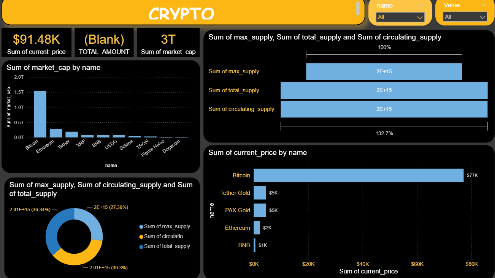

# crypto_market_analysis

📌 Project Overview

This project analyzes cryptocurrency market data using Power BI. The dashboard provides insights into market capitalization, price performance, trading volume, supply metrics, risk levels, and overall market trends. The objective is to help users understand the performance and behavior of different cryptocurrencies through interactive visualizations.

🎯 Objectives

Analyze cryptocurrency market performance.
Identify top-performing and high-value cryptocurrencies.
Track price changes over different time periods.
Evaluate risk levels across cryptocurrencies.
Compare market capitalization, trading volume, and supply metrics.

🛠️ Tools Used

Power BI
Microsoft Excel
Data Cleaning & Transformation
Data Visualization

📊 Dashboard Features

1. Market Capitalization Analysis
   Total Market Capitalization of cryptocurrencies.
   Market Cap ranking of each coin.
   Comparison of top cryptocurrencies by market value.
2. Price Analysis

Current price of cryptocurrencies.
24-hour price change percentage.
High and low price movement analysis.

3. Growth Momentum Analysis

Current Price Tracking.
24-Hour Change (%).
7-Day Change (%).
Performance comparison across cryptocurrencies.

4. Price Calculator

Calculate value based on the number of coins.
Compare investment values across different cryptocurrencies.

5. Risk Analysis

Categorization of cryptocurrencies into:
High Risk
Medium Risk
Low Risk
Helps users understand volatility levels.

6. Top 5 Market Cap Coins

Identification of the top 5 cryptocurrencies based on market capitalization.

7. Top 5 Current Price Coins

Identification of cryptocurrencies with the highest current prices.

8. Volume & Supply Analysis

Trading Volume comparison.
Circulating Supply analysis.
Relationship between supply and market performance.

📈 Key Insights

Top cryptocurrencies dominate overall market capitalization.
High-risk coins generally show greater price volatility.
Market leaders maintain stronger trading volumes.
Price momentum helps identify short-term market trends.
Supply and volume significantly influence market movement.
[10:37 am, 11/06/2026] 𝐒𝐚𝐮𝐫𝐚𝐯𝐯𝐯: 📷 Dashboard Preview
Dashboard screenshots are available in the Images folder.

📂 Project Structure

Crypto_Market_Analysis/
├── Dataset/ │ └── crypto_market_data.xlsx
├── Images/ │ ├── dashboard.png │ └── dataset_preview.png
├── Dashboard.pbix
└── README.md

📚 Learning Outcomes

Data Cleaning and Transformation
Power BI Dashboard Development
Data Visualization Best Practices
Cryptocurrency Market Analysis
Business Insight Generation
